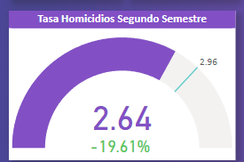

# *Siniestros viales*

### **Introducción**:

En este proyecto tomamos el rol de un Data Analyst, donde el Observatorio de Movilidad y Seguridad Vial (OMSV) nos solicita la elaboración de un proyecto con el fin de generar información que le permita a las autoridades locales tomar medidas para disminuir la cantidad de víctimas fatales de los siniestros viales.

### *Datos*:
Para el análisis se nos otorgó una base de datos llamada homicidios.xlsx, que dentro contiene dos tablas:
* **Hechos:** contiene información sobre el lugar donde ocurrió el incidente, incluyendo la comuna, dirección, coordenadas y datos sobre los vehículos involucrados

* **Victimas**: contiene información sobre las victimas, como la edad, genero, fecha de fallecimiento, vehículo o rol que ocupaba al sufrir el accidente

*La base de datos se extrajeron de la pagina de [BA Data](https://data.buenosaires.gob.ar/dataset/)*

### Desarrollo:

**EDA:** se realizó un análisis exploratorio de datos para comprender mejor el conjunto de datos y extraer informacion valiosa para futuros análisis. Los detalles los pueden consultar en la notebook del [EDA](content/notebooks/EDA.ipynb)

**Dashboard:** el proyecto contiene 4 páginas, conteniendo la Introducción, Dashboard sobre Lugar y Tiempo, Dashboard sobre las víctimas y una ultima página dedicada a los KPIs.

Empezamos con el Dashborard de *Accidentes: Lugar y Tiempo*

En este dashboard nos enfocamos mayormente en mostrar datos referidos a las rutas, comunas, medidas de tiempo y distintos datos

En este dashboard nos enfocamos mayormente en las víctimas, mostrando datos importantes como el vehiculo, rol de la victima, genero, rango etario y la gravedad del accidente

**KPIs:**

Hemos propuesto 3 KPIs para mostrar algunos sectores especificos y ver si se pudo hacer un avance.

* **Primer KPI:** Reducir en un 10% la tasa de homicidios en siniestros viales de los últimos seis meses, en CABA, en comparación con la tasa de homicidios en siniestros viales del semestre anterior

**Observaciones:**

En el primer KPI se notó que no solo se cumplió, sino que se superó el objetivo por casi el doble, reduciendo los homicidios en casi un 20% con respecto al semestre anterior

Se propone continuar con las medidas que se estan realizando, y seguir disminuyendo este numero

* **Segundo KPI:** Reducir en un 7% la cantidad de accidentes mortales de motociclistas en el último año, en CABA, respecto al año anterior.

**Observaciones:**

* En el segundo KPI se notó totalmente lo contrario a la meta propuesta, ya que la cantidad de victimas en moticicleta aumentó un 42%. Esto suponemos que se debe mas que nada a la cuarentena del año 2020, donde la gente casi ni salía a la calle, ya que hacían todo remoto (colegios, trabajo) y el trafico era extremadamente bajo.

Para esto proponemos que se continuen los esfuerzos por reducirlo y ver las mediciones en el siguiente año, para poder observar realmente cual es el cambio sin que esté el sesgo de haber pasado por una cuarentena.

Se sugiere: 
- Hacer mas controles a las motocicletas, multas por no usar casco y aumentar las señalizaciones

- Hacer una campaña para concientizar a los otros conductores a prestar atencion a las motocicletas, para evitar accidentes

* **Tercer KPI:** Reducir un 15% la tasa de accidentes mortales en siniestros viales sobre una interseccion en los últimos seis meses, en CABA, en comparación a la tasa de accidentes mortales en siniestros viales sobre una interseccion del semestre anterior

**Observaciones:**

En el KPI se notó que se cumplió el objetivo, ya que se llegó a un 39% en vez del 15% propuesto, reduciendo efectivvamente la tasa de accidentes mortales en intersecciones.

Se propone continuar con las medidas que se estan realizando, para seguir disminuyendo este numero.

